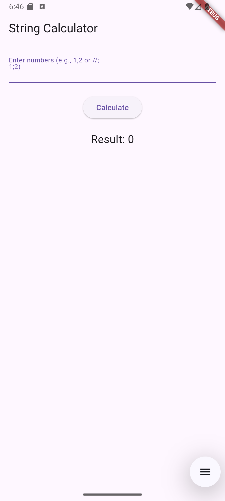
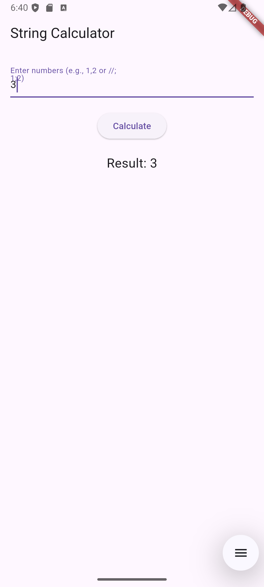
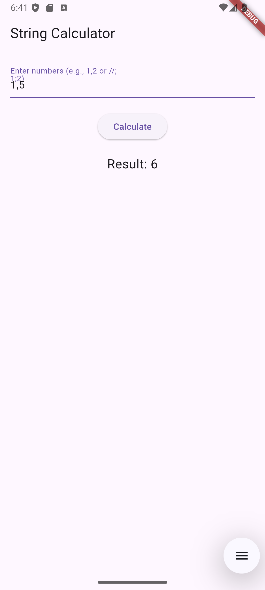
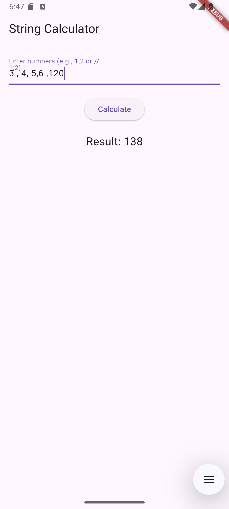
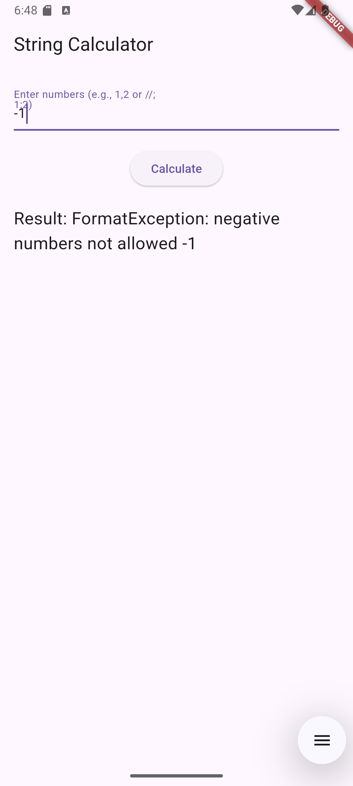

# Incubyte TDD Assessment - String Calculator

This repository contains a Flutter implementation of the String Calculator TDD Kata as part of the Incubyte recruitment process.

## Project Structure
- `lib/main.dart`: Main Flutter app with UI.
- `lib/string_calculator.dart`: Logic for the string calculator.
- `test/string_calculator_test.dart`: Unit tests following TDD.

## How to Run
1. Clone the repository: `git clone <your-repo-url>`.
2. Navigate to the project directory: `cd string_calculator`.
3. Run the app: `flutter run`.
4. Run tests: `flutter test`.

## Screenshots
- [Empty Input]: 
- [Single Number]: 
- [Two Numbers]: 
- [Custom Delimiter]: 
- [Negative Number]: 

## TDD Process
- Commits are made after each passing test.
- Refactoring is performed after each step.
- See commit history for detailed evolution.

## Notes
- The app supports all requirements: empty string, single/multiple numbers, new lines, custom delimiters, and negative number validation.
- Tests are written using `flutter_test` to ensure code quality.

## Submission
This repository link can be submitted to Incubyte for review.